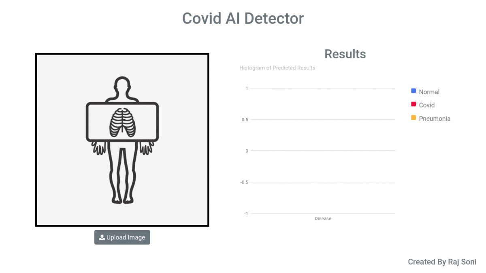
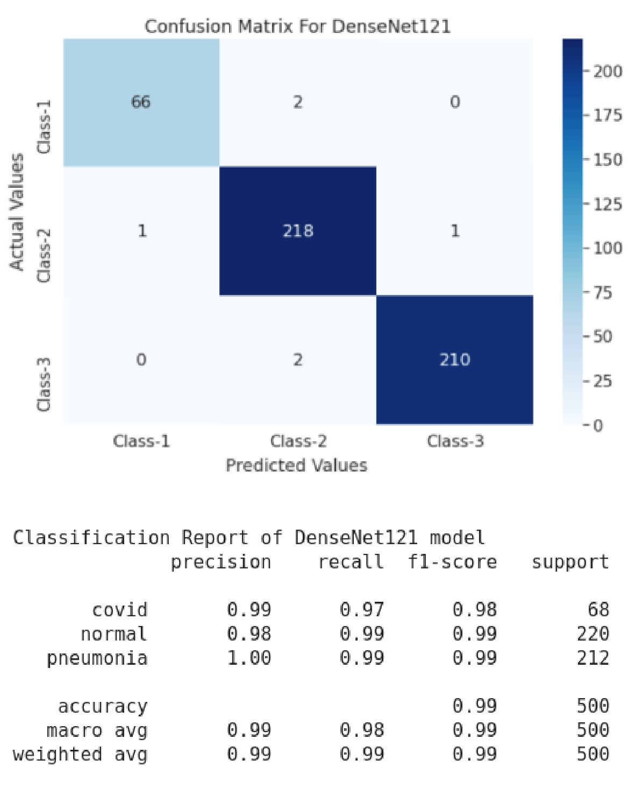

# Covid-19_Detection_Using_Chest_X-Ray_Images
Project Link - https://covid-ai-app.herokuapp.com/ 
Code Link - https://colab.research.google.com/drive/1M1llJCJCZCDsOZ6Itna8CQpgNwcNr271?usp=sharing

## A Deep Learning Projects For Diagnosis of COVID Disease by Chest X-Ray Images.

Here are some screenshots of Flask Web GUI.

## In this project, the DenseNet121 architecture is used for image classification and achieves 99% accuracy.

Here are Model Classification Report and Confusion Matrix

